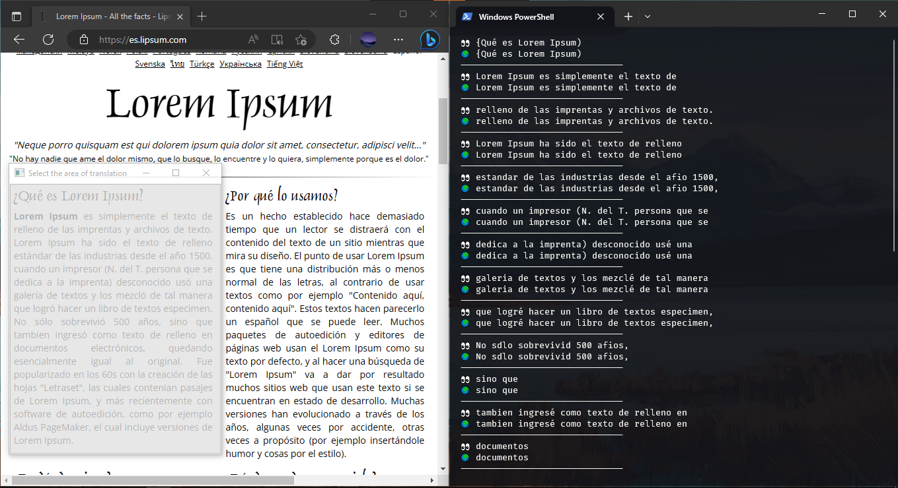
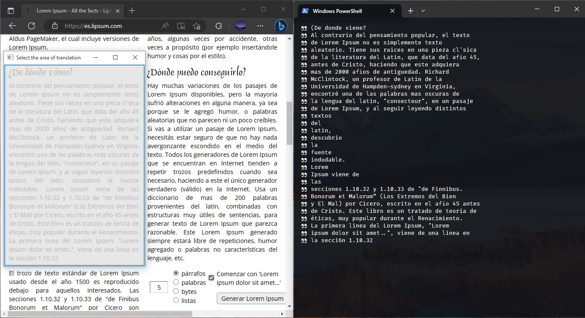

<h1 align="center">TransLens</h1>

<h4 align="center">Simple program that extracts text from a section of the screen.</h4>

<p align="center">
 
 
 
 
 
</p>




## Description

The project consists of a program written in Python that creates a semi-transparent window on the user's screen and extracts the text from everything inside that area. The main objective of the program is to facilitate the extraction of text from images or areas of the screen where the text cannot be copied or selected in a traditional way.

The program uses the [Tesseract](https://github.com/UB-Mannheim/tesseract/wiki) library, which is an open source Optical Character Recognition (OCR) engine. Tesseract uses artificial intelligence algorithms to analyze images and recognize the text in them.

Once the text has been extracted, the program can save it to a text file for later use. You can also copy the text to the clipboard to paste it elsewhere or send it by email, for example.

The program is very useful for people who need to extract text from images or screen areas quickly and efficiently. For example, it can be used by researchers who need to extract image data from graphs or tables, or by publishers who need to extract text from PDF files.

## Requirements

- [x] [Python 3.9](https://www.python.org/downloads/)
- [x] [Tesseract](https://github.com/UB-Mannheim/tesseract/wiki)
- [x] [Virtualenv](https://virtualenv.pypa.io/en/latest/installation.html)

## Settings

Variables adjust the function of the program in a simple way, they are found in the [settings.py](./settings.py) file.

| VARIABLE       | TYPE           | FUNCTION                                                                                                                                                                           |
| -------------- | -------------- | ---------------------------------------------------------------------------------------------------------------------------------------------------------------------------------- |
| AUTOMATIC      | BOOLEAN        | Indicates whether the script runs continuously indefinitely until program execution is canceled                                                                                    |
| MODE           | STRING         | Indicates the function of the program, admits two values: "TRANSLATE" to translate and "TRANSCRIBE" to transcribe                                                                  |
| VIEW_LANG      | STRING         | Indicates the language that was searched for in the image, it can be None and detect the language automatically, but it is recommended to specify the language for better results. |
| TRANSLATE_LANG | STRING or None | Indicates to which language the text will be translated                                                                                                                            |
| TRANSPARENCE   | INT            | Indicates the level of transparency of the window                                                                                                                                  |
| TITLE_WINDOW   | STRING         | Indicates the title of the created window                                                                                                                                          |
| PATH_TESSERACT | STRING         | It indicates the path where the Tesseract program was installed, by default it has the location path in winows.                                                                    |

## How To Use

Once you meet the requirements to run this program, you can perform the following steps.

The first thing is to clone this repository.

```bash
git clone https://github.com/EddyBel/TransLens.git
```

You can then proceed to create a virtual environment for this project, note that you must use a version of python 3.9 or higher, for this example it was named "env" but it can be called as requested.

```bash
python.exe -m venv env
```

or

```bash
python3.9.exe -m venv env
```

The next thing is to enter the virtual environment created, for each operating system it is different:

> ## Windows
>
> ```bash
> .\env\Scripts\activate
> ```

> ## Linux
>
> ```bash
> source .\env\bin\activate
> ```

Now you can install the necessary modules for the program with the following command.

```bash
pip install -r requeriments.txt
```

To finish you can run the main script with the following command and voila! you can use the program normally.

```bash
python.exe .\app.py
```

---

> ## :warning: Note
>
> If you get an error finding the Tesseract file (tesseract.exe), verify that you are pointing to the correct installation path you can modify the program path with the PATH_TESSERACT variable in the settings.py file.
>
> If you get any errors finding the languages in the folder (tessdata) yourself, check that they have been installed correctly and that all the files (.traineddata) are found.

## License

MIT

---

[@GitHub](https://github.com/EddyBel) &nbsp;&middot;&nbsp; [@Linkedin](https://www.linkedin.com/in/eduardo-rangel-eddybel/)
